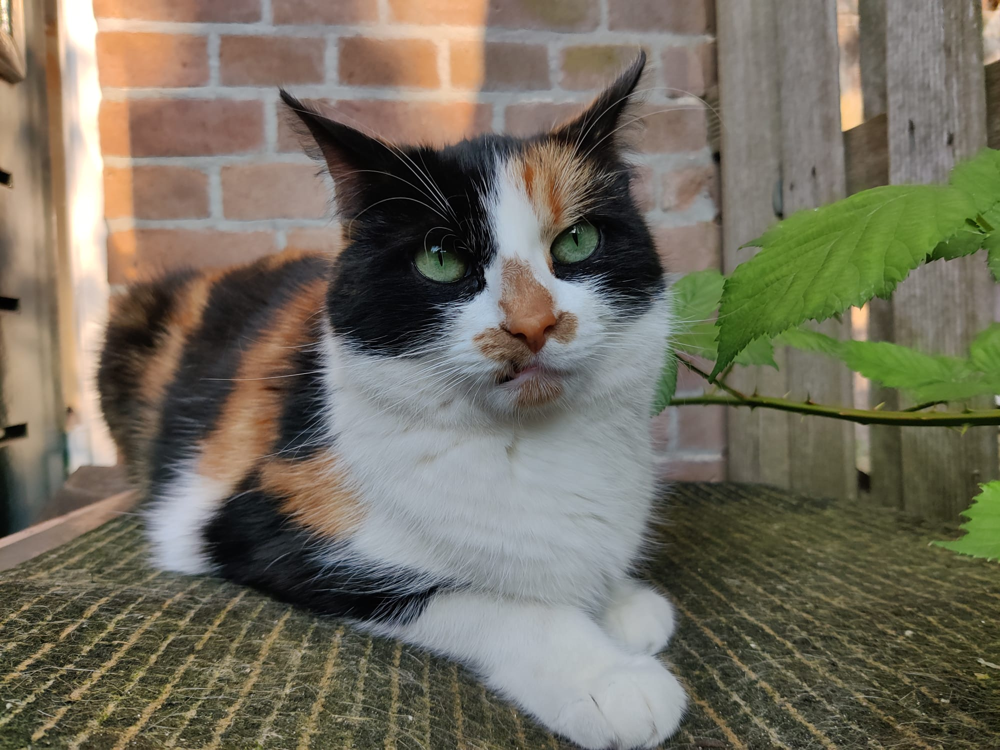
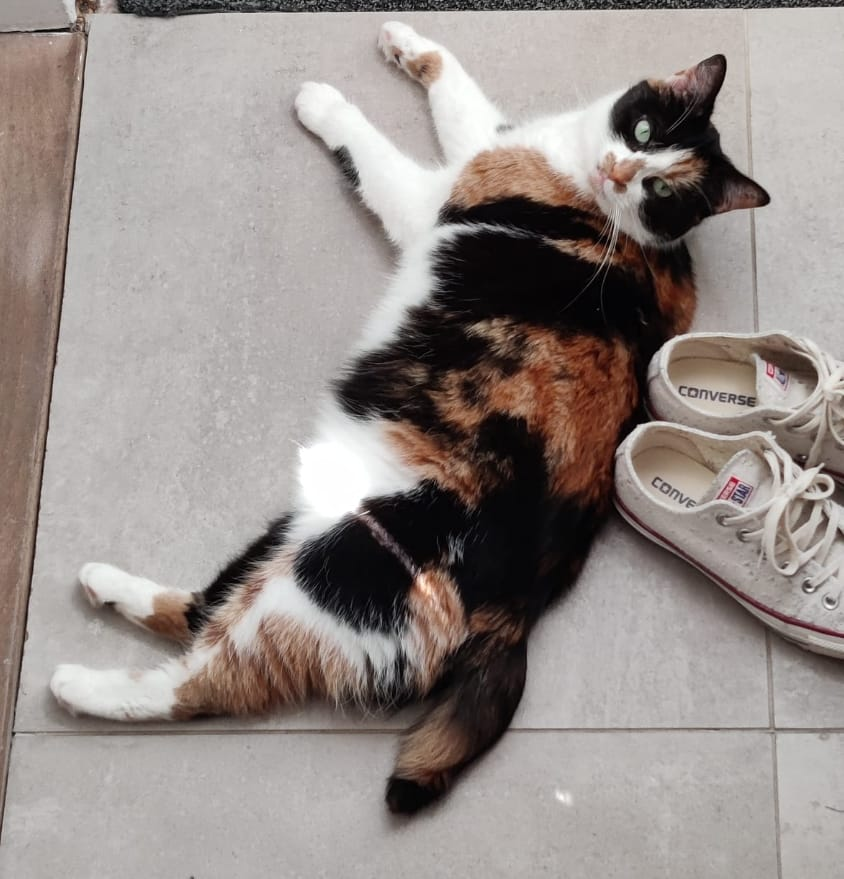

Have you seen Doozy, or do you know where to find her? Let us know!

Our cat Doozy has been missing. She has 3 colors, a short tail. She is very sweet, used to be in the garden but not on the street. We live on the Javastraat - Cronjebuurt. Please contact us at: **jchenadec@gmail.com**

You can also find this post on [Amivedi](https://www.amivedi.nl/detail/?meldingid=2131006).


|               |               |
| ------------- |:-------------:|
| Gender        | Female          |   
| Color         | Calico (Lapjes) |
| Where         | Haarlem, Javastraat, Cronjé |
| Since         | The night of 13 Feb  |


Thanks for your help, we hope to find her soon!
